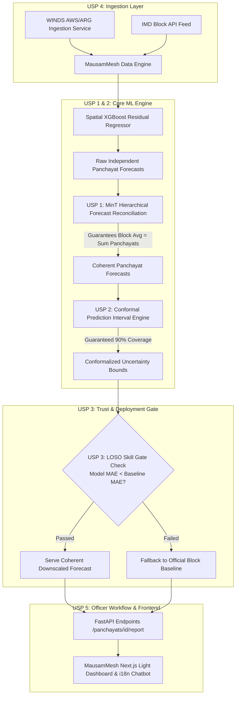

# MausamMesh (मौसममेश) — Panchayat Weather Intelligence Platform

> **"Panchayat Weather Intelligence"** / **"Weather Intelligence for Every Panchayat."** / **"हर पंचायत के लिए मौसम बुद्धिमत्ता।"**
> Production-Quality Agro-Meteorological Decision Support System downscaling IMD Block-level weather forecasts to Panchayat resolution for precision farming (SIH26074).

---

## 🏆 Competitive Positioning & Differentiation Matrix

| Capability / Differentiation | Typical Competitor Submissions | **MausamMesh (Our Solution)** |
| :--- | :--- | :--- |
| **Microclimate Residual Modeling** | Basic XGBoost / Random Forest (Table stakes) | **Spatial XGBoost** with 1-Hop Spatial Graph, IDW Rain & Wind-Facing Aspect |
| **Block ↔ Panchayat Forecast Coherence** | ❌ Independent predictions fail to sum/average to official Block forecast | **USP 1: MinT Hierarchical Forecast Reconciliation** *(Mathematically guaranteed coherence)* |
| **Uncertainty Quantification** | ❌ None, or uncalibrated quantile regression | **USP 2: MAPIE Split-Conformal Prediction Intervals** *(Statistically guaranteed 90% coverage rate)* |
| **Overfitting & Deployment Safeguard** | ❌ Blind deployment even where downscaling loses to Block forecast | **USP 3: Leave-One-Station-Out (LOSO) Skill Gate** *(Transparent fallback to Block forecast when downscaling loses)* |
| **Ground Station Expansion Alignment** | ❌ Static satellite reanalysis or sparse IMD AWS only | **USP 4: WINDS Telemetry Connector** *(Built for Ministry of Agriculture's 300,000 ARG network rollout)* |
| **Agro-Advisory Delivery Workflow** | ❌ Raw unvalidated AI output asking farmers to install a new app | **USP 5: DAMU Officer-in-the-Loop Approval Console** *(Auto-drafts bulletin $\rightarrow$ DAMU scientist approves $\rightarrow$ SMS / WhatsApp dispatch)* |

---

## 🏗️ System Architecture



---

## 🌟 Key Features & Extension Points

### 1. Multilingual Support (i18n)
Full localization in English (`en`), Hindi (`hi`), and Marathi (`mr`) managed via `frontend/src/lib/i18n.ts`. Controls all headers, labels, advisory messages, crop names, and navigation.

### 2. Suggestive AI Chatbot (`ChatbotWidget.tsx`)
Floating rule-based chatbot widget offering screen-contextual quick reply prompts and local knowledge base answers. Includes an extensible `askAssistant(query: string)` hook for seamless integration with live LLM / voice pipelines.

### 3. PDF Agromet Bulletin Export (`GET /panchayats/{id}/report`)
Generates formal PDF advisory bulletins using the MausamMesh design palette (`#15803D` agricultural green, `#FAF9F5` warm background, `#1A202C` deep text). Produces files named `mausammesh-report-{panchayat-name}-{date}.pdf`.

---

## 🚀 Quick Start & Installation

### Prerequisites
- Python 3.10+
- Node.js 18+ and npm

### 1. Backend Setup & Data Seeding
```bash
# Navigate to backend directory
cd backend

# Install dependencies
pip install -r requirements.txt

# Seed spatial dataset and train MinT-Reconciled Conformal XGBoost model
python scripts/seed_data.py

# Run FastAPI backend server (Port 8000)
python -m uvicorn app.main:app --host 0.0.0.0 --port 8000 --reload
```

### 2. Frontend Setup
```bash
# Navigate to frontend directory
cd frontend

# Install dependencies
npm install

# Start Next.js development server (Port 3000)
npm run dev
```

### 3. Verification & Test Suite
```bash
# Run backend pytest test suite
cd backend
pytest
```
