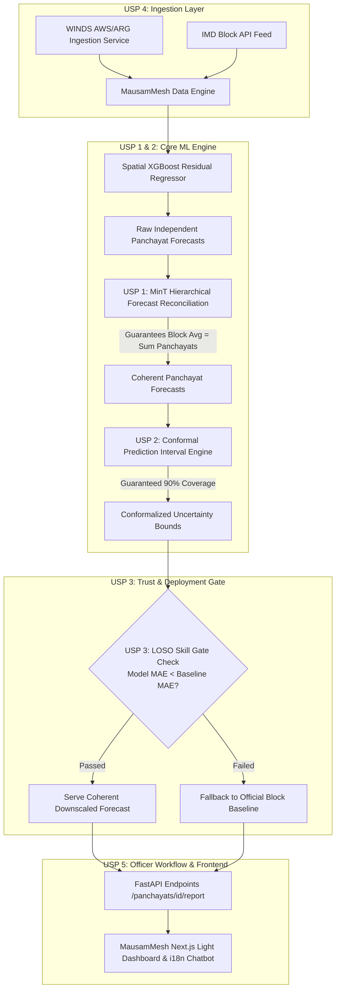

# MausamMesh (मौसममेश) — Panchayat Weather Intelligence Platform

> **"From IMD forecast to verified Panchayat action."** / **"आयएमडी अंदाजापासून प्रत्यक्ष पंचायत कृतीपर्यंत।"** / **"आईएमडी पूर्वानुमान से सत्यापित पंचायत कार्रवाई तक।"**  
> **"Broad forecast → local intelligence → verified officer action."**  
> Production-grade Agro-Meteorological Decision Support System downscaling official IMD Block forecasts to 1 km² Panchayat resolution for precision farming (SIH26074 • Ministry of Earth Sciences / IMD).

---

## 🏛️ Institutional Positioning for IMD

Existing IMD services and agro-advisory platforms are the official foundation. **MausamMesh is an IMD-compatible intelligence layer, not a competing forecast authority.** It supports meteorologists and agrometeorologists by adding spatial refinement, quality control, prioritization, auditability, and post-event verification.

| Existing IMD Capability | MausamMesh Enhancement |
| :--- | :--- |
| **Block/location forecast** | Panchayat-level refinement and spatial micro-variation |
| **Advisory generation** | Officer-editable draft with automated risk priority ranking |
| **Forecast display** | Conformal uncertainty intervals, accuracy & source provenance |
| **Operational data** | Quality checks, missing-data flags & dynamic weight renormalization |
| **Published advice** | Full audit trail and post-event observation verification loop |

---

## 🏆 Competitive Positioning & Differentiation Matrix

| Capability / Differentiation | Typical Competitor Submissions | **MausamMesh (Our Solution)** |
| :--- | :--- | :--- |
| **Microclimate Residual Modeling** | Basic XGBoost / Random Forest (Table stakes) | **Two-Part Hurdle XGBoost** with 1-Hop Spatial Graph, IDW Rain & Wind Aspect |
| **Block ↔ Panchayat Forecast Coherence** | ❌ Independent predictions fail to sum/average to official Block forecast | **USP 1: MinT Hierarchical Forecast Reconciliation** *(Mathematically guaranteed coherence)* |
| **Uncertainty & DecisionShield** | ❌ None, or uncalibrated quantile regression | **USP 2: DecisionShield & MAPIE Conformal Intervals** *(Statistically guaranteed 90% coverage rate)* |
| **Overfitting & Deployment Safeguard** | ❌ Blind deployment even where downscaling loses to Block forecast | **USP 3: Leave-One-Station-Out (LOSO) Skill Gate** *(Transparent fallback to Block forecast when downscaling loses)* |
| **Ground Station Expansion Alignment** | ❌ Static satellite reanalysis or sparse IMD AWS only | **USP 4: WINDS Telemetry Connector** *(Built for Ministry of Agriculture's 300,000 ARG network rollout)* |
| **Agro-Advisory Delivery Workflow** | ❌ Raw unvalidated AI output asking farmers to install a new app | **USP 5: Officer-in-the-Loop Priority Queue Console** *(Auto-drafts bulletin $\rightarrow$ DAMU scientist approves $\rightarrow$ SMS / WhatsApp dispatch)* |

---

## 🏗️ System Architecture



---

## 🌟 Key Features & Extension Points

### 1. Multilingual Support (i18n)
Full localization in English (`en`), Hindi (`hi`), and Marathi (`mr`) managed via `frontend/src/lib/i18n.ts`. Controls all headers, labels, advisory messages, crop names, and navigation.

### 2. Suggestive AI Chatbot (`ChatbotWidget.tsx`)
Floating rule-based chatbot widget offering screen-contextual quick reply prompts and local knowledge base answers. Includes an extensible `askAssistant(query: string)` hook for seamless integration with live LLM / voice pipelines.

### 3. PDF Agromet Bulletin Export (`GET /panchayats/{id}/report`)
Generates formal PDF advisory bulletins using the MausamMesh design palette (`#15803D` agricultural green, `#FAF9F5` warm background, `#1A202C` deep text). Produces files named `mausammesh-report-{panchayat-name}-{date}.pdf`.

---

## 🎯 Core USP: Panchayat Priority Queue

The **Panchayat Priority Queue** automatically ranks panchayats by composite agricultural-meteorological risk ($0-100$ score) so IMD and DAMU Nodal Officers instantly identify which panchayats require urgent advisory dispatch or field inspection without manually checking hundreds of locations.

### 🧮 Priority Scoring Formula & Default Weights

$$\text{Score} = w_{\text{sev}} \cdot f_{\text{severity}} + w_{\text{vuln}} \cdot f_{\text{crop\_vuln}} + w_{\text{impact}} \cdot f_{\text{impact}} + w_{\text{area}} \cdot f_{\text{area}} + w_{\text{hh}} \cdot f_{\text{hh}}$$

| Factor | Code Key | Default Weight | Description |
| :--- | :--- | :--- | :--- |
| **Weather Severity** | `weather_severity` | **35%** ($0.35$) | Scaled upper bound of 90% conformal prediction interval (`rain_mm + q90`). |
| **Crop Vulnerability** | `crop_vulnerability` | **25%** ($0.25$) | Stage-specific sensitivity factor $s_{c,g,h} \in [0,1]$ (e.g., Soybean/pod formation + heavy rain = 0.85). |
| **Potential Impact** | `potential_impact` | **15%** ($0.15$) | Derived terrain drainage risk (slope runoff & elevation difference). |
| **Exposed Crop Area** | `exposed_area` | **15%** ($0.15$) | Percentile-normalized agricultural land area (ha). |
| **Exposed Farm Households** | `farm_households` | **10%** ($0.10$) | Percentile-normalized farm household count. |

### 🚨 Risk Tier Thresholds & Safety Floor

- **Very High**: $\text{Score} \ge 75$ (Pulsing red hazard outline)
- **High**: $50 \le \text{Score} < 75$ (Orange alert outline)
- **Medium**: $25 \le \text{Score} < 50$ (Yellow notice outline)
- **Low**: $\text{Score} < 25$ (Emerald safe outline)

> [!IMPORTANT]
> **IMD Safety Floor Rule**: Any panchayat expecting IMD Heavy Rain ($\ge 64.5$ mm) is guaranteed a minimum priority tier of **High** regardless of exposure parameters.

> [!NOTE]
> **Uncertainty Warning (`verify_before_dispatch`)**: Low forecast confidence ($90\%$ interval width $> 6.0$ mm) does NOT artificially lower rank; it prominently flags `"verify_before_dispatch"` to urge officer verification.

> [!TIP]
> **Missing Data Renormalization**: If exposure data is incomplete (`source="demo"` or missing profile), active factor weights dynamically renormalize to sum to $1.0$ and set `partial_data: true`.

### 📡 Priority Queue API Endpoints

- `GET /api/v1/priority-queue`: Returns ranked list of panchayats, factor breakdown, top human-readable reasons, and tier summary counts. Filterable by `block_id`, `district_id`, `lead_day`, `hazard`, `crop`, and custom factor `weights`.
- `GET /api/v1/priority-queue/config`: Returns default factor weights and tier threshold definitions.
- `GET /api/v1/priority-queue/export.csv`: Downloads priority queue as a structured CSV report for offline field distribution.

### 🌐 Production Sourcing Plan for Real Data Deployment

When transitioning from demo data (`source="demo"`) to full real-time operational deployment, MausamMesh integrates the following authoritative datasets:

1. **Panchayat & Demographic Data**: Census of India (2011) village-level demographics & Ministry of Panchayati Raj **LGD (Local Government Directory)** 6-digit codes.
2. **Crop Profile & Agricultural Land Use**: Ministry of Agriculture **Agri-Census** & land-use statistics merged with **Sentinel-2 / ESA WorldCover 10m** satellite crop mapping.
3. **Crop Sensitivity Matrix**: Official **IMD Agromet Advisory Crop Calendars** defining stage-specific sensitivity coefficients ($s_{c,g,h}$).
4. **Meteorological Inputs**: **IMD AWS / ARG Network** telemetry via **WINDS API Connector**.

---

## 🚀 Quick Start & Installation

### Prerequisites
- Python 3.10+
- Node.js 18+ and npm

### 1. Backend Setup & Data Seeding
```bash
# Navigate to backend directory
cd backend

# Install dependencies
pip install -r requirements.txt

# Seed spatial dataset and train MinT-Reconciled Conformal XGBoost model
python scripts/seed_data.py

# Run FastAPI backend server (Port 8000)
python -m uvicorn app.main:app --host 0.0.0.0 --port 8000 --reload
```

### 2. Frontend Setup
```bash
# Navigate to frontend directory
cd frontend

# Install dependencies
npm install

# Start Next.js development server (Port 3000)
npm run dev
```

### 3. Verification & Test Suite
```bash
# Run backend pytest test suite
cd backend
pytest
```
